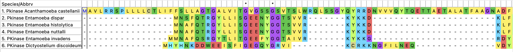

# Проект по биоинформатике

Таксон: Amoebozoa

[Предварительная презентация](https://docs.google.com/presentation/d/1Lgw_mo-bOEfliUJNfFKrZ-5cQHP_G44nK4LotiZp-MY)

[Финальная презентация](https://docs.google.com/presentation/d/12wR5WS7QpZ2dxL9aeH5cqlS9O6hMuqR3EA1naPGKOQI)

### Выравнивания

### Деревья

